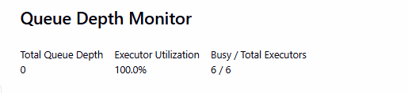
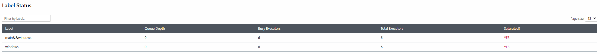
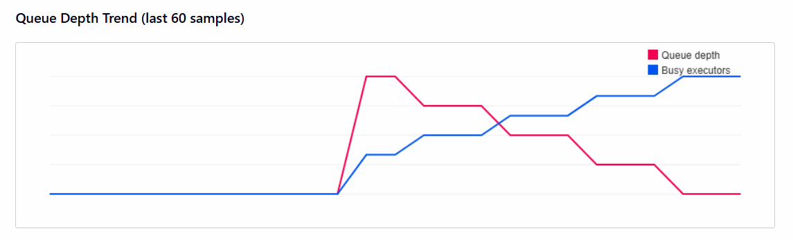
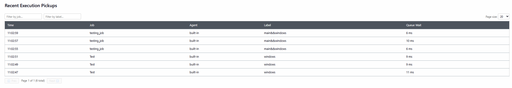
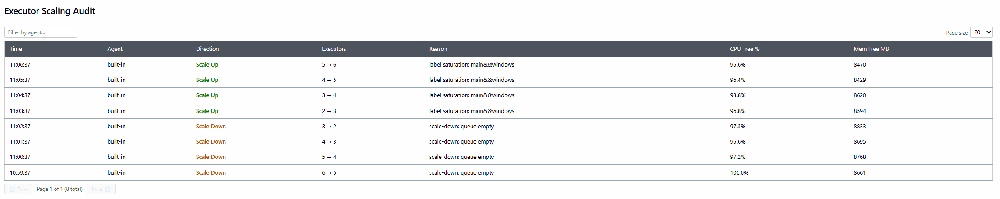

# Queue Depth Monitor — Jenkins Plugin

A Jenkins plugin that monitors build queue depth and executor utilization across labeled agents in real time. It provides intelligent agent selection, resource-aware executor auto-scaling, a webhook for build completion events, and email alerts when queue depth trends upward.

## Features

- **Queue depth monitoring** — tracks queue depth per agent label in real time
- **Executor utilization** — measures busy vs. total executors globally and per label
- **Executor auto-scaling** — scales executors up under queue pressure and back down when the queue is empty, respecting CPU/memory thresholds, a configurable cooldown, and an excluded-agents list
- **Dynamic label recommendations** — suggests label re-assignment to capable agents when scaling is not possible
- **Queue depth trend email alerts** — emails configurable recipients when queue depth rises for several consecutive polls in a row, with a cooldown to prevent alert spam
- **Build pickup tracking** — records which agent and label picked up each job and how long it waited
- **Scaling audit log** — keeps a full history of every scale-up and scale-down decision
- **Live dashboard** — auto-refreshing UI at `/queue-monitor` with charts and audit tables
- **REST API** — JSON endpoints for external tooling integration
- **Build notifications** — POSTs a structured JSON payload to a configurable endpoint after every build completes, regardless of outcome (success, failure, abort)

## Requirements

| Requirement | Version |
|-------------|---------|
| Jenkins | 2.541.2 or later |
| Java | 21 (JRE/JDK) |
| Maven | 3.8+ (build only) |

## Building

```bash
mvn clean package -DskipTests
```

The installable plugin artifact is produced at `target/queue-monitor-3.1.0.hpi`.

To run tests:

```bash
mvn test
```

> The auto-generated `InjectedTest` is excluded from the Surefire run due to a known `/closures/` 404 in the test harness against BOM 2.479.x. All hand-written tests in `src/test/` run normally.

## Installation

1. Build the `.hpi` file (see above) or download a release artifact.
2. In Jenkins: **Manage Jenkins → Plugins → Advanced → Deploy Plugin**.
3. Upload `queue-monitor.hpi` and restart Jenkins.

> Depends on the **Mailer** plugin (for trend alert emails) and **Pipeline: API** / **Pipeline: Supporting APIs** (for per-node-block agent tracking). If you install via the plugin manager these are pulled in automatically; a manual `.hpi` upload requires them to already be installed.

## Configuration

Navigate to **Manage Jenkins → System → Queue Depth Monitor** to configure all settings. Settings are split into four groups.

### General

| Setting | Default | Description |
|---------|---------|-------------|
| Poll Interval (seconds) | 30 | How often the background collector runs (minimum 10) |
| Max Snapshots | 2880 | Hard cap on snapshot count (memory budget) |

### Executor Scaling

| Setting | Default | Description |
|---------|---------|-------------|
| Dynamic Label Enabled | true | Enable dynamic label assignment recommendations |
| Executor Scaling Enabled | true | Enable resource-aware executor scaling |
| Max Executors Per Agent | 20 | Ceiling for auto-scaling |
| Min Executors Per Agent | 1 | Floor for scale-down |
| Scaling Min Free CPU % | 20 | Minimum free CPU before adding an executor |
| Scaling Min Free Memory MB | 256 | Minimum free RAM before adding an executor |
| Scaling Cooldown (seconds) | 300 | Minimum gap between scaling decisions on the same agent |
| Excluded Agents | _(empty)_ | Comma-separated agent names to skip during executor scale-up/scale-down |

### Build Notifications

| Setting | Default | Description |
|---------|---------|-------------|
| Enable Build Notifications | false | Activate the webhook; when disabled, no HTTP requests are made |
| Endpoint URL | _(empty)_ | Full `http://` or `https://` URL to POST build results to |
| Username | _(empty)_ | Username for HTTP Basic authentication |
| Password | _(empty)_ | Password for HTTP Basic authentication; stored AES-encrypted |
| Bearer Token | _(empty)_ | Token for `Authorization: Bearer …`; stored AES-encrypted |
| Max Log Lines in Payload | 5000 | Maximum build-log lines included in the payload; 0 = no limit |

Authentication is selected automatically based on what is filled in:

| Credentials provided | Auth sent |
|----------------------|-----------|
| Username + Password | `Authorization: Basic base64(username:password)` |
| Bearer Token only | `Authorization: Bearer <token>` |
| Neither | No `Authorization` header |

Fill in **either** Username/Password **or** Bearer Token — not both. If a Username is present, Basic auth always takes priority.

### Trend Alerts

| Setting | Default | Description |
|---------|---------|-------------|
| Enable Trend Email Alerts | false | Send an email when queue depth rises for several consecutive polls in a row |
| Recipient Email Addresses | _(empty)_ | Comma-separated list of addresses to notify, e.g. `ops@example.com, oncall@example.com` |
| Consecutive Increasing Samples | 3 | How many consecutive polls must each exceed the previous one to count as a sustained trend (minimum 2) |
| Minimum Queue Depth to Alert | 5 | The latest sample must reach at least this depth before an alert fires, filtering out noise near zero |
| Notification Cooldown (seconds) | 900 | Minimum gap between successive trend alert emails |

Emails are sent through Jenkins' own SMTP configuration — set this up first under **Manage Jenkins → System → E-mail Notification** (Jenkins Location / SMTP server), since the plugin reuses that session rather than configuring its own mail transport.

Once the first alert fires, another is sent only when **both** conditions hold: the cooldown has elapsed, and queue depth is still on a sustained upward trend at that moment. A cooldown expiring during a lull does not trigger a repeat alert.

## Dashboard

Once installed, a **Queue Monitor** link appears in the Jenkins sidebar. The dashboard auto-refreshes every 30 seconds and is divided into the following sections.

---

### Summary Cards



The top of the dashboard displays three at-a-glance metrics:

| Card | Description |
|------|-------------|
| **Total Queue Depth** | The current number of builds waiting across all labels |
| **Executor Utilization** | Percentage of total executors that are actively running a build |
| **Busy / Total Executors** | Raw count of busy executors vs. the total available across all agents |

In the example above, 3 builds are queued, all 3 executors are busy (100% utilization), giving a 3/3 reading.

---

### Label Status



A filterable, paginated table showing the current state of each agent label known to Jenkins.

| Column | Description |
|--------|-------------|
| **Label** | The Jenkins agent label (e.g. `windows`, `main&&windows`) |
| **Queue Depth** | Number of builds currently waiting for an executor with this label |
| **Busy Executors** | Number of executors actively running builds under this label |
| **Total Executors** | Total executors available for this label across all agents |
| **Saturated?** | Highlighted **YES** (red) when every executor for the label is busy and builds are still queued — this triggers the auto-scaler |

Rows are sorted with saturated labels first, then by descending queue depth, so the most critical labels are always visible at the top. Use the filter input and page-size selector to navigate large label sets.

---

### Queue Depth Trend



A canvas chart plotting the last 60 collected samples (up to the configured poll interval apart).

| Line | Description |
|------|-------------|
| **Red — Queue depth** | Total number of queued builds at each sample point |
| **Blue — Busy executors** | Number of executors actively running a build at each sample point |

The chart makes it easy to spot queue spikes and correlate them with executor activity. A sudden red spike followed by a blue rise indicates the auto-scaler added executors to absorb the backlog.

---

### Recent Execution Pickups



A filterable, paginated table of the most recent build-pickup events — one row per build that left the queue and started executing.

| Column | Description |
|--------|-------------|
| **Time** | Timestamp when the build was picked up by an executor |
| **Job** | Name of the Jenkins job that was executed |
| **Agent** | The specific agent node that ran the build |
| **Label** | The matched agent label used to route the build |
| **Queue Wait** | How long the build waited in the queue before execution began (ms / s / min) |

Records are displayed newest-first. Use the **Filter by job** and **Filter by label** inputs to narrow results. In the example above, `testing_job` is consistently routing to the `main&&windows` label while `Test` routes to `windows`, both picking up within single-digit milliseconds — indicating healthy executor availability at that point.

---

### Executor Scaling Audit



A filterable, paginated audit log of every executor scaling decision made by the plugin.

| Column | Description |
|--------|-------------|
| **Time** | Timestamp of the scaling decision |
| **Agent** | The agent node whose executor count was changed |
| **Direction** | **Scale Up** (green) when executors were added; **Scale Down** (orange) when executors were reduced |
| **Executors** | The transition, e.g. `2 → 3` for a scale-up or `3 → 2` for a scale-down |
| **Reason** | Human-readable reason: `label saturation: <label>` for scale-up; `scale-down: queue empty` for scale-down |
| **CPU Free %** | Percentage of CPU that was free on the agent at the time of the decision |
| **Mem Free MB** | Free physical memory (MB) on the agent at the time of the decision |

In the example above, the agent scaled down from 6 → 2 executors over four consecutive poll cycles (queue empty, cooldown respected), then scaled back up from 2 → 3 when the `main&&windows` label became saturated again. Scale-ups only occur when both CPU and memory headroom meet the configured thresholds.

---

## Build Notifications

When **Enable Build Notifications** is turned on, the plugin POSTs a JSON payload to the configured endpoint after **every** build completes — regardless of whether the result is `SUCCESS`, `FAILURE`, `UNSTABLE`, or `ABORTED`.

### Payload format

```json
{
  "jobName":     "my-pipeline",
  "buildNumber": 42,
  "jobUrl":      "https://jenkins.example.com/job/my-pipeline/42/",
  "startTime":   "2026-06-01T10:00:00Z",
  "endTime":     "2026-06-01T10:05:00Z",
  "status":      "SUCCESS",
  "log":         "Started by user …\n[Pipeline] Start of Pipeline\n…",
  "agents": [
    {
      "slaveName": "linux-agent-1",
      "label":     "linux",
      "usedFrom":  "2026-06-01T10:00:01Z",
      "usedUntil": "2026-06-01T10:05:02Z"
    }
  ]
}
```

All timestamps are in ISO 8601 / UTC format.

| Field | Type | Description |
|-------|------|-------------|
| `jobName` | string | Full name of the Jenkins job (folder-qualified if applicable) |
| `buildNumber` | integer | Build number |
| `jobUrl` | string | Absolute URL to the specific build page |
| `startTime` | string (ISO 8601) | When the build started executing on an agent |
| `endTime` | string (ISO 8601) | When the build execution finished |
| `status` | string | Final build result: `SUCCESS`, `FAILURE`, `UNSTABLE`, `ABORTED`, or `UNKNOWN` |
| `log` | string | Build log output, up to `Max Log Lines` lines, lines joined with `\n` |
| `agents` | array | One entry per agent that ran this build (see below) |

#### Agent entry fields

| Field | Type | Description |
|-------|------|-------------|
| `slaveName` | string | Node name of the agent (`built-in` for the Jenkins controller) |
| `label` | string | Label expression used to route the build to this agent |
| `usedFrom` | string (ISO 8601) | Timestamp when the agent started executing the build |
| `usedUntil` | string (ISO 8601) | Timestamp when the agent finished executing the build |

> **Pipeline multi-agent note:** the current implementation captures the primary executor that started the top-level build. Per-`node()` step tracking for complex pipelines with multiple agents requires the `workflow-cps` plugin as an additional dependency, which is not yet included.

### HTTP contract

The plugin sends an HTTP `POST` with `Content-Type: application/json; charset=UTF-8`. Authentication is applied automatically — Basic if a username is configured, Bearer if only a token is configured, or none. The plugin expects any `2xx` response to indicate success. Non-2xx responses are logged as warnings but do not affect the build result. The request times out after 10 s (connect) / 30 s (read).

---

## REST API

All endpoints require at least `Jenkins.READ` permission.

| Endpoint | Description |
|----------|-------------|
| `GET /queue-monitor/apiSnapshot` | Current queue snapshot (JSON object) |
| `GET /queue-monitor/apiHistory?limit=N` | Last N snapshots for charting (JSON array) |
| `GET /queue-monitor/apiPickups` | All pickup events, newest-first (JSON array) |
| `GET /queue-monitor/apiScaling` | All scaling audit events, newest-first (JSON array) |

## Architecture

```
QueueMetricsCollector  (AsyncPeriodicWork)
    │  polls Jenkins every N seconds
    ├─► QueueSnapshot       — immutable point-in-time state
    ├─► MetricsStore        — ConcurrentLinkedDeque ring buffer (bounded)
    ├─► SchedulingEngine    — evaluates queue; scales executors or recommends labels
    └─► QueueTrendMonitor   — checks for a sustained increasing queue-depth trend
                              → QueueTrendNotifier.send() — email via Mailer plugin, cooldown-gated

BuildPickupListener    (RunListener)
    │  fires on job start, completion, and finalization
    ├─► onStarted:    records PickupEvent (agent, label, wait time)
    │                 captures AgentStart (agent name, label, timestamp) in ConcurrentHashMap
    ├─► onCompleted:  refreshes pipeline label hints
    └─► onFinalized:  builds full payload (job details + agent usage + log)
                      → BuildNotifier.send() — HTTP POST to configured endpoint

BuildNotifier
    │  stateless utility; reads GlobalConfig on every call
    ├─► serialises payload to JSON (net.sf.json)
    ├─► applies configured auth (NONE / API_KEY / BASIC / BEARER)
    └─► fires HTTP POST via java.net.HttpURLConnection

QueueTrendMonitor      (Extension singleton)
    │  evaluated once per poll cycle, right after a fresh snapshot is stored
    ├─► flags N consecutive strictly-increasing snapshots above a min-depth floor
    ├─► tracks lastNotifiedAt in memory for the cooldown window
    └─► QueueTrendNotifier — builds and sends the alert email (jakarta.mail via Mailer plugin)

QueueMonitorAction     (RootAction @ /queue-monitor)
    ├─► serves the Jelly dashboard (index.jelly)
    └─► exposes REST endpoints (doApiSnapshot, doApiHistory, doApiPickups, doApiScaling)

GlobalConfig           (GlobalConfiguration @ Manage Jenkins → System)
    └─► all tuneable settings with safe defaults
        includes notification endpoint, auth credentials (Secret), log-line cap,
        and trend-alert recipients/thresholds/cooldown
```

## License

[MIT License](https://opensource.org/licenses/MIT)
